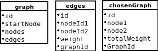

# slutProjekt

## Idé
Jag har tänkt använda mig av koden från mitt gymnasiearbete som räknar ut den kortaste vägen i en given graf. För att använda mig av databser och GUI hade jag tänkt mig att lägga in dessa grafer i en databas och sedan rita ut det i någon form av GUI

## Länk till githubrepository med kod för att räkna ut kortaste vägen
https://github.com/IsseNisse/granneMetoden

## Databas

## Post Mortem
https://github.com/IsseNisse/slutProjekt/blob/master/postMortem.md

## Loggbok

### Lektion 1
Har gjort planering och ska nu göra skisser på klassdiagram etc. Jag har dock ingen aning hur jag ska göra dom eftersom jag inte vet hur programmet ska se ut över huvudtaget. Samma sak med planeringen i githubs bräde grej för där kan jag göra det mer tydligt och specifikt men jag har ingen aning hur eftersom jag inte vet hur programmet ska se ut. Därför tycker jag att saker som klassdiagram är helt värdelöst.

### Lektion 2
Har suttit och försökt lösa problemet med min bruteforce algoritm och det fungerar nu

### Lektion 3
Har gjort en databas som nu förhoppningsvis fungerar och går att använda till projektet

### Lektion 4 
Har lagt till koden från gymnasiearbetet. Har också lagt till databaskoden och modifierat den så att jag nu kan ta ut den information jag behöver från databasen

### Lektion 5 
Har börjat modifiera koden så att den kan använda informationen från databasen i programmet.

### Lektion 6
Har försökt få till så att programmet kan använda sig av infon från databasen men har inte gått så bra.

### Lektion 7
Har gjort arrayLists för viss information från databasen för att lättare kunna implemetera den  i koden. Dock fungerar det fortfarande inte då den inte lägger in någon information från databasen i arraylisten och jag vet inte varför.
